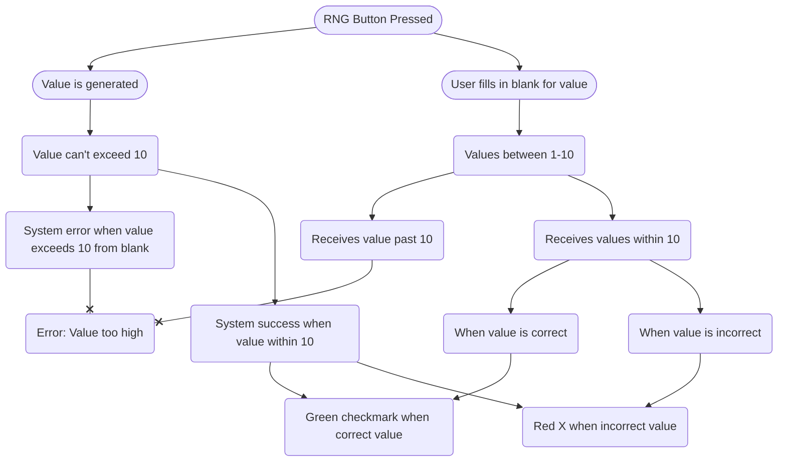

# Number Button Game
## Hit the button and guess what the random number is!

```mermaid
flowchart TD
Start([ RNG Button Pressed])-->Ops([Value is generated])
Start-->A([User fills in blank for value]) 
Ops--> B(Value can't exceed 10)
A--> C(Values between 1-10)
B-->D(System error when value exceeds 10 from blank)
C-->E(Receives value past 10)
C-->F(Receives values within 10)
E--xG(Error: Value too high)
D--xG
B-->H(System success when value within 10)
H-->I(Green checkmark when correct value)
H-->J(Red X when incorrect value)
F-->K( When value is correct)
K-->I
F-->L(When value is incorrect)
L-->J
```
